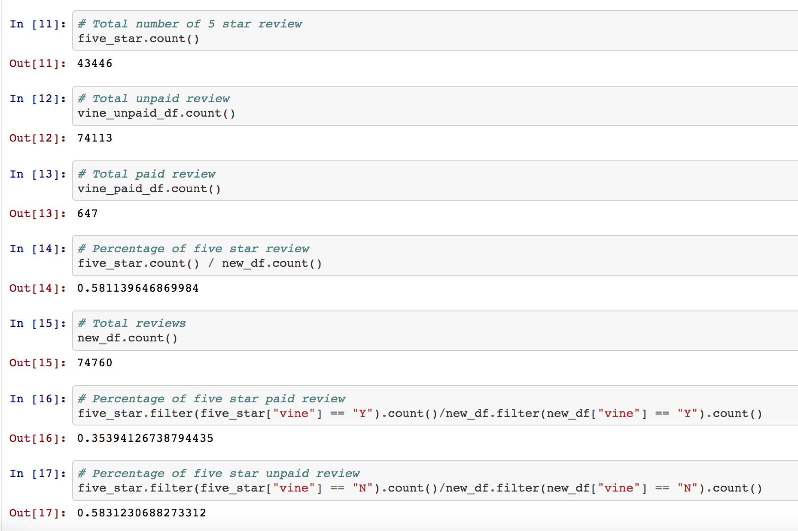

# Big Data and Spark 

## Overview of Project

The purpose of this project is to analyze Amazon reviews for the given dataset using PySpark to perform the ETL process to extract the dataset, transform the data, connect to an AWS RDS instance, and load the transformed data into pgAdmin. Then, by using PySpark, Pandas, or SQL to determine if there is any bias toward favorable reviews from the given dataset.

## Resources:
* Data sources: s3.amazonaws.com/amazon-reviews-pds/tsv/amazon_reviews_us_Beauty_v1_00.tsv.gz

## Tools
* Colab Notebook
* AWS RDS
* PostgreSQL, pgadmin

## Result

Based on the above image result shows:
* There are 74,760 total reviews.
* There are 647 Vine reviews.
* There are 74,113 non-Vine reviews.
* There are 43,446 Vine 5 star reviews and 58% of 5 star reviews
* The percentage of five star paid review is 34% and the percentage of five star unpaid review is 58%.

## Summary 
Based on the results, this describes that there is a negativity bias for reviews in the Vine program. One suggestion could be using statistical analysis (mean, median and mode) for star-rating Vine program review.
